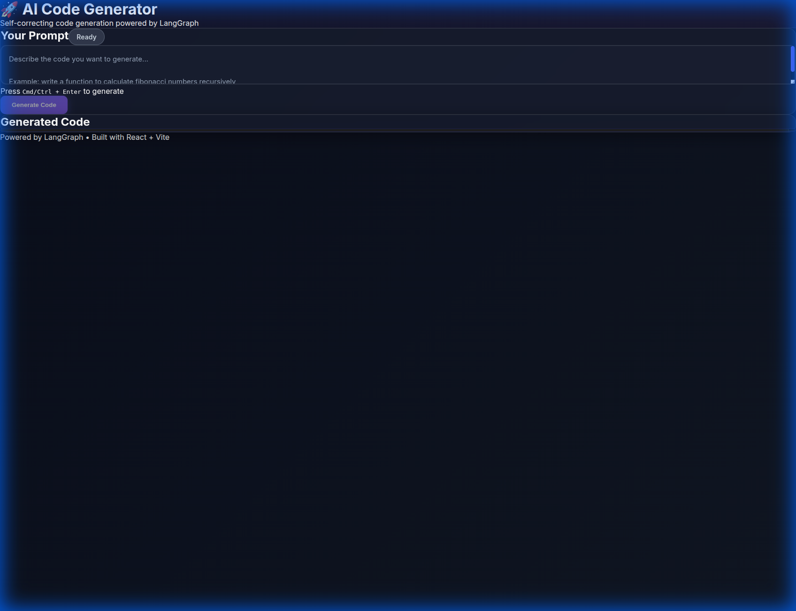

# 🚀 AI Code Generator

A production-ready, self-correcting code generation web application powered by **LangGraph** and **local LLMs**. Features a modern React frontend with real-time streaming updates and a FastAPI backend.




## ✨ Features

- 🤖 **Self-Correcting Agent**: Automatically validates and fixes generated code up to 3 attempts
- ⚡ **Real-time Streaming**: Server-Sent Events (SSE) for live status updates
- 🎨 **Premium UI**: Modern dark mode with glassmorphism effects
- 📝 **Monaco Editor**: VS Code-like code editor with syntax highlighting
- 🔄 **Retry Logic**: Intelligent error handling and code refinement
- 📦 **Easy Deploy**: Simple setup with conda environment management

## 🏗️ Architecture

```
┌─────────────────┐      HTTP/SSE      ┌─────────────────┐
│  React Frontend │ ◄─────────────────► │  FastAPI Server │
│   (Vite + UI)   │                     │   + LangGraph   │
└─────────────────┘                     └────────┬────────┘
                                                 │
                                                 ▼
                                        ┌─────────────────┐
                                        │  vLLM Server    │
                                        │   (Port 5005)   │
                                        └─────────────────┘
```

## 📋 Prerequisites

- **Python 3.8+** with conda
- **Node.js 18+** and npm
- **vLLM server** running locally (see setup below)

## 🚀 Quick Start

### 1. Clone the Repository

```bash
git clone <your-repo-url>
cd code-generator
```

### 2. Set Up vLLM Server

First, start your vLLM server with the model:

```bash
# In a separate terminal
conda create -n vllm_oss python=3.10 -y
conda activate vllm_oss
pip install vllm

# Start vLLM server
python -m vllm.entrypoints.openai.api_server \
  --port=5005 \
  --model openai/gpt-oss-20b
```

### 3. Set Up Backend

```bash
# Create and activate environment
conda create -n analytics_vidhya python=3.10 -y
conda activate analytics_vidhya

# Install dependencies
cd backend
pip install -r requirements.txt

# Copy environment configuration
cp .env.example .env

# Start backend server
python main.py
```

The backend will be available at `http://localhost:8000`

### 4. Set Up Frontend

```bash
# In a new terminal
cd frontend

# Install dependencies
npm install

# Copy environment configuration
cp .env.example .env

# Start development server
npm run dev
```

The frontend will be available at `http://localhost:5173`

## 💻 Usage

1. **Open your browser** to `http://localhost:5173`
2. **Enter a prompt** describing the code you want (e.g., "write a function to calculate fibonacci numbers")
3. **Click "Generate Code"** or press `Cmd/Ctrl + Enter`
4. **Watch the magic**: See real-time status updates as the agent generates and validates code
5. **Copy or Download**: Use the built-in buttons to save your generated code

### Example Prompts

```
write a function to calculate fibonacci numbers recursively

create a pandas dataframe and perform a pivot table operation

implement a binary search tree with insert and search methods

write a decorator to measure function execution time
```

## 📁 Project Structure

```
code-generator/
├── backend/
│   ├── main.py              # FastAPI server with SSE streaming
│   ├── coder.py             # LangGraph agent workflow
│   ├── requirements.txt     # Python dependencies
│   └── .env.example         # Environment configuration
├── frontend/
│   ├── src/
│   │   ├── App.jsx          # Main application component
│   │   ├── components/
│   │   │   ├── CodeEditor.jsx    # Monaco editor wrapper
│   │   │   └── ChatInterface.jsx # Message display
│   │   ├── services/
│   │   │   └── api.js       # API client with SSE
│   │   └── index.css        # Premium styling
│   ├── package.json
│   └── vite.config.js
├── coder.py                 # Original standalone script
├── requirements.txt         # Original dependencies
└── README.md
```

## 🔧 API Documentation

### Endpoints

#### `GET /`
Health check endpoint

#### `POST /api/generate`
Generate code with streaming updates

**Query Parameters:**
- `prompt` (string, required): Code generation prompt
- `max_attempts` (int, optional): Maximum retry attempts (default: 3)
- `verbose` (bool, optional): Include detailed messages (default: true)

**Response:** Server-Sent Events stream with events:
- `status`: Agent status updates (GENERATING, CHECKING, etc.)
- `code`: Generated code solution
- `message`: Agent messages
- `complete`: Generation completed
- `error`: Error occurred

#### `POST /api/validate`
Validate Python code syntax

**Request Body:**
```json
{
  "code": "def hello():\n    print('world')"
}
```

## 🎨 Customization

### Change vLLM Model

Edit `backend/coder.py`:

```python
def get_llm():
    return ChatOpenAI(
        model="your-model-name",  # Change this
        base_url="http://localhost:5005/v1",
        # ...
    )
```

### Modify UI Theme

Edit `frontend/src/index.css` to customize colors:

```css
:root {
  --accent-primary: #6366f1;  /* Primary color */
  --accent-secondary: #8b5cf6; /* Secondary color */
  /* ... */
}
```

## 🧪 Testing

### Test Backend

```bash
cd backend
pytest tests/ -v
```

### Test Frontend Build

```bash
cd frontend
npm run build
```

## 🐛 Troubleshooting

### Backend won't start
- **Check vLLM server**: Ensure vLLM is running on port 5005
- **Check dependencies**: Run `pip install -r requirements.txt` again
- **Check environment**: Activate `analytics_vidhya` conda environment

### Frontend can't connect to backend
- **CORS issues**: Backend allows all origins by default
- **Port conflicts**: Ensure port 8000 is available
- **Environment variable**: Check `.env` has correct API URL

### Code generation fails
- **Check vLLM model**: Verify model name matches vLLM server
- **Check server logs**: Look for errors in backend terminal
- **Try simpler prompt**: Start with basic requests to test

## 📝 License

MIT License - feel free to use this project for any purpose.

## 🤝 Contributing

Contributions are welcome! Please feel free to submit a Pull Request.

1. Fork the repository
2. Create your feature branch (`git checkout -b feature/AmazingFeature`)
3. Commit your changes (`git commit -m 'Add some AmazingFeature'`)
4. Push to the branch (`git push origin feature/AmazingFeature`)
5. Open a Pull Request

## 🙏 Acknowledgments

- **LangGraph** for the agent workflow framework
- **FastAPI** for the backend server
- **Monaco Editor** for the code editor
- **vLLM** for local LLM inference

## 📧 Support

If you have any questions or run into issues, please open an issue on GitHub.

---

**Built with ❤️ using LangGraph, FastAPI, and React**
